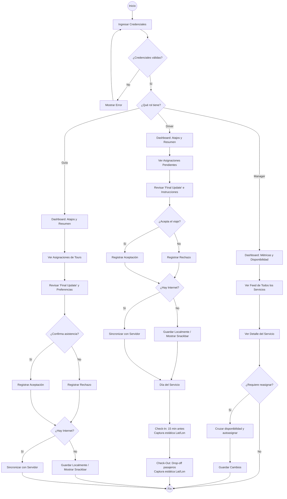

# LinceOPS (Proyecto Lince)

## 1. Nombre y Propósito
**LinceOPS** es una aplicación móvil diseñada para centralizar la coordinación operativa de una empresa de turismo. Su propósito es gestionar los servicios, asignaciones y disponibilidad del personal en terreno, reemplazando métodos ineficientes mediante un sistema claro y ordenado.

## 2. Identidad Visual
El diseño de la aplicación emplea una paleta de colores sobria que incorpora toques de color verde, funcionando como un guiño a la naturaleza debido al rubro turístico de la empresa.
* **Logotipo:** Mantiene un lince como ícono representativo usando un aspecto minimalista y colores inspirados en la página oficial. Se encuentra ubicado en `docs/diseno/logo.png`.
* **Paleta de Colores:**
  * **Principal (`#4A7C59`):** Utilizado para destacar los botones de acción.
  * **Secundario (`#EAE6DE`):** Utilizado para los cuadros con la información.
  * **Fondo (`#FAF6F0`):** Aplicado como fondo para todas las pantallas.
  * **Texto (`#222728`):** Utilizado para el texto descriptivo.
  * **Adicional (`#F8E0A8`):** Utilizado para logos de tiempo y estados de "listo para marcaje".

## 3. Flujo de Usuario
El siguiente diagrama UML detalla el recorrido principal de la aplicación para los distintos roles. El archivo exportado en formato imagen se encuentra en `docs/diseno/flujo-usuario-uml.png`.

## 4. Pantallas Principales
Debido a la pérdida de resolución al exportar en formato PNG desde Stitch, las interfaces visuales se integraron como archivos HTML interactuables en el repositorio.
* **Acceso / Validación:** `docs/evidencias/Diseno/Interfaces/InicioSesion`
* **Inicio / Dashboard:** `docs/evidencias/Diseno/Interfaces/Manager/DashBoard`, `.../Driver/DashBoard`, y `.../Guia/DashBoard`
* **Feed de Asignaciones:** `docs/evidencias/Diseno/Interfaces/Driver/Servicios`
* **Feed de Servicios:** `docs/evidencias/Diseno/Interfaces/Guia/Servicios` y `.../Manager/Servicios`
* **Detalle (Final Update):** `docs/evidencias/Diseno/Interfaces/PopUpDetalles`
* **Check in / out:** `docs/evidencias/Diseno/Interfaces/Driver/Marcaje`
* **Perfil / Disponibilidad:** `docs/evidencias/Diseno/Interfaces/Driver/Perfil` y `.../Guia/Perfil`
* **Gestión:** `docs/evidencias/Diseno/Interfaces/Manager/Gestión`

## 5. Integrantes
* **[Darithza Cárdenas]** - [Software Developer]
* **[Matias Wenger]** - [Product Owner]
* **[David Soto]** - [Software Developer]
* **[Amador Suarez ]** - [GUI Developer]

## 6. Tecnologías y Diseño
* **Lenguaje:** [Kotlin]
* **UI Toolkit:** [Jetpack Compose]
* **Arquitectura:** [MVVM]
* **Herramientas de Diseño:** [Material Design 3, Stitch, Mermaid.js]